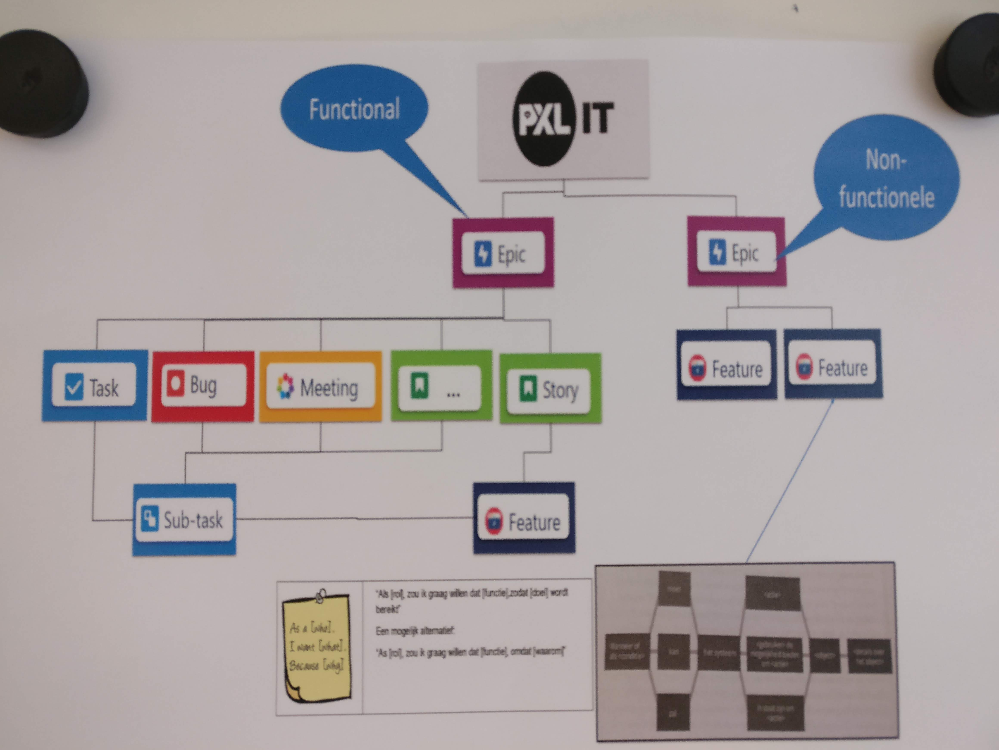

# Research Project #
In this repository, you'll find all the information to get started with the Research Project for AI & Robotics. 

## Contents ##
Folder 'webots' contains some default environments to test your project. New environments will be added soon.

## Quick Guide: Combining ROS & WeBots ##
0. Install Ubuntu (we use 18.04 LTS) in dual boot (recommended) or in VM
1. Install ROS (Melodic)
2. Install WeBots
3. Create WeBots world (or load a world that is provided in this repository)
4. Make sure to properly install all examples, sample code & provided srv/msg files : 
    > [https://cyberbotics.com/doc/guide/tutorial-7-using-ros](https://cyberbotics.com/doc/guide/tutorial-7-using-ros)
5. Put ROS controller on robot in WeBots
	  > This controller ships with WeBots and is written in C++, but we won't be editing this
6. Use rospy to create a node. Try some services that are available on the WeBots ROS controller on the robot
    > ROS will be covered extensively in the AI & Robotics course
7. Later on in the project, we will host some workshops to do more complex actions in WeBots. (create own world, own robots, ...)

## Useful Links ##
ROS: [http://www.ros.org/](http://www.ros.org/)  
WeBots robot simulator: [https://cyberbotics.com/](https://cyberbotics.com/)  

WeBots tutorials: [https://cyberbotics.com/doc/guide/](https://cyberbotics.com/doc/guide/)  
ROS + WeBots: [https://cyberbotics.com/doc/guide/tutorial-7-using-ros](https://cyberbotics.com/doc/guide/tutorial-7-using-ros) 

OpenCV: [https://opencv.org/](https://opencv.org/) 

## Project Management ##
Concerning user stories & project management in JIRA:  
We will be using the model that has been described during the Software Analysis course. Considering we aren't working in a user-centered context, user stories are not sufficient to describe the desired behavior of the bot.

For this reason, we encourage the teams to use **features** as more detailed clarifications of user stories to define specific behaviors of the bot.

So, to give a brief overview:

EPIC
- Task = related to project mgmt, not part of the product
- Bug = issues found during implementation & testing
- Meeting = meeting
- User Story = High-level description of desired behavior from user perspective
	Feature = More detailed clarifications of a user story to define specific behaviors of the bot
		=> check Software Analysis course for the schematic of a feature.
	
- Tasks, bugs & features can futher be subdivided in sub-tasks for individual assignment and time tracking.

